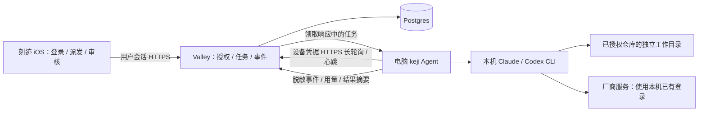

# 刻迹：Valley 云端中转与本地执行器可行性设计

日期：2026-09-12

状态：设计草案，供用户评审；未开始实现或部署。
范围：iOS 真机远程派发 Claude Code / Codex 任务，以及刻迹账号与本地电脑 CLI 的绑定。

## 1. 结论与产品边界

方案可行。采用 **iOS → Valley 持久化任务 → 本地 keji Agent 主动领取 → 本机 Claude/Codex 执行 → Valley 回传 → iOS 查看与审核**。

Valley 负责身份、授权、任务和事件；电脑负责代码、CLI 登录、进程与工作目录。手机与电脑不必处于同一网络，电脑只需主动访问公网 HTTPS。服务端不保存 Claude/Codex 的密码、OAuth 凭据或 API Key。

“绑定”是刻迹用户授权一份本地执行器安装，不是把刻迹账号转换成 Claude/OpenAI 账号。电脑上的厂商 CLI 必须由用户在本机独立登录；消耗的是该 CLI 实际使用的账户或 API 凭据的配额。刻迹邮箱与厂商邮箱无需相同，也不能据此判断账号归属。

必要条件：电脑开机、keji Agent 运行、网络可用、厂商 CLI 登录有效、目标仓库已在本地授权。电脑休眠或关机时任务排队；Valley 中转不会让离线电脑继续计算。建议首发 macOS LaunchAgent，用户登录后自动运行；锁屏与休眠分开显示，不能承诺合盖后可执行。

本设计包含可靠派发、取消、限额等待、恢复、结果审核；暂不承诺任意交互式终端接管、跨电脑迁移正在运行的厂商会话、自动推送或部署代码、共享厂商账号池。

## 2. 已核对的现有基础

| 部分 | 实际已有 | 本次需要新增或调整 |
| --- | --- | --- |
| Valley timetrace | Go/Gin/GORM/Postgres；游客/验证码登录；独立用户；opaque token 会话；bootstrap/sync | 设备授权、执行器凭据、仓库登记、远程作业、事件、服务端状态机 |
| iOS | SwiftUI、Keychain、任务/时间记录、AI 执行页面、状态同步 | 电脑绑定页、仓库/工具选择、真实执行客户端、待确认指令与事件刷新 |
| keji CLI | Python、SQLite、Claude/Codex 适配器、worktree、队列、限额等待、session resume | 常驻控制通道、进程管理、本地持久化收发队列、设备认证、远程任务映射 |
| React | 可演示的页面和模拟 AI store | 消费相同远程接口；不是 iOS 真机链路的中间依赖 |

证据：`Valley/internal/apps/timetrace/{app,repository,model,sync}.go`；`TimeTrace/cli/keji/{scheduler,config}.py`、`adapters/{base,claude,codex}.py`；`ios/KeJi/Networking/SyncEngine.swift`。

当前不能直接套一层 HTTP 就发布：

1. `/sync` 接受客户端 AI execution、时间记录和 task 状态的 LWW 更新。真实执行状态必须改为服务端权威，否则旧手机快照可以覆盖已经完成或取消的执行。
2. `scheduler._dispatch` 同步等待 adapter 返回，尚无独立心跳或控制通道。
3. `run_streaming` 先读完 stdout 再读 stderr，stderr 堵塞可能让进程挂住；timeout 在 stdout 读完后才进入等待，不是全过程超时；输出还整体积存在内存中。远程长任务需要改造。
4. 当前 `allowed_repos=[]` 表示不限制。远程模式必须改成“未登记仓库不接任务”，不能继承这一默认值。
5. worktree 与提示词中的禁止 push 规则是工作流保护，不构成操作系统隔离；远程执行还需本机权限配置与可验证的限制。

本次只核对源码、命令帮助与官方资料，没有运行付费 AI 请求或验证真实账号登录状态。已安装版本：Codex CLI 0.153.4、Claude Code 2.1.258。功能与限制按版本建立兼容性清单，不能只凭版本号认定实测通过。

## 3. 为什么选这条架构

| 路径 | 适配情况 | 判断 |
| --- | --- | --- |
| Valley 排队，本机 Agent 主动拉取 | 复用现有 CLI、会话和仓库；无入站端口要求 | 推荐 |
| Valley 通过 SSH 进入电脑 | 需要连接性、SSH 凭据与额外电脑配置 | 不作为产品主路径 |
| Valley 自己运行 Claude/Codex | 需要云端工作区、独立登录与环境；不再是本地电脑执行 | 后续单独产品能力 |

首发选 HTTPS 长轮询，不同时建设 WebSocket 和消息总线。Postgres 保存所有耐久任务/控制指令/事件；Redis 可以唤醒等待者及限流，通知丢失也要能从 Postgres 补取。Valley 副本间通过数据库事务协调，不能依赖单进程内存队列。



## 4. 账号如何绑定电脑和 CLI

### 4.1 身份与授权关系

```text
刻迹正式用户 user_id
  ├─ 手机会话 A、手机会话 B
  ├─ 电脑执行器 runner_id（例如：家里的 Mac mini）
  │    ├─ 专用设备凭据及可撤销 token family
  │    ├─ 本地仓库登记 workspace_id → 本机路径（路径只保留本地）
  │    └─ 工具配置 tool_profile_id → provider + 本地 CLI 登录上下文
  └─ 另一台电脑执行器 runner_id（例如：MacBook）
```

首发关系：一个刻迹账号可以绑定多台电脑；一个本地 OS 用户下的 keji 安装同时只绑定一个刻迹账号。不同 OS 用户视为不同安装，`runner_id` 是随机安装标识，不以序列号或 MAC 地址识别设备。

`tool_profile_id` 首发仅支持每个 provider 一个明确配置；实际可执行文件路径、环境和凭据上下文在本地确定。云端只知道 provider、显示别名、版本、能力和最近状态。将来支持同一电脑多厂商账号时，需先验证各 CLI 的凭据隔离；不能仅换环境变量就声称隔离成立。

### 4.2 首次配对流程

参考 RFC 8628 的设备授权思路，提供刻迹专用配对协议。它不冒充 Claude/OpenAI 的 OAuth 登录，也不声称当前已具备完整标准 OAuth 授权服务器。

1. 用户在电脑运行拟新增命令 `keji cloud login`。CLI 向 Valley 申请配对，获得高熵 `device_code`、短 `user_code`、有效期和轮询间隔。
2. 终端显示短码和二维码。二维码只携带验证入口和 `user_code`，不携带 `device_code`、用户 token 或设备长期凭据。先支持 App 内输入短码，二维码属于同一流程的快捷入口。
3. 用户在手机登录正式刻迹账号，进入“我的电脑 → 添加电脑”，扫码或输入短码。游客必须先完成账号升级，防止游客合并/重装导致设备归属含糊。
4. App 展示请求中的电脑名称、平台、申请时间、要求的权限以及“仅接受本地登记仓库”。这些设备描述只是提示信息，不是硬件身份认证；用户对照电脑上的短码后确认。
5. CLI 轮询得到批准状态和脱敏刻迹账号，终端让用户确认归属后激活绑定。这样误扫或他人抢先批准不会让电脑无提示绑定到错误账号。
6. Valley 原子创建 runner 及设备会话。CLI 将 refresh token 存入 macOS Keychain，access token 留在内存；后续由 LaunchAgent 在同一个 OS 用户身份下访问。Keychain 无法访问时显示等待本机解锁/重新登录。
7. 本机登记仓库和权限后，手机才能选择它派发任务。批准配对不等于开放整块磁盘。

配对批准属于敏感授权，要求最近 10 分钟完成过账号认证；较旧手机会话先重新验证。服务端记录实际认证时间，不能把一次 access token 刷新当作重新验证身份。

建议初始参数：配对 10 分钟过期、至少 5 秒轮询、短码使用排除混淆字符的随机 8 位编码；结合来源、短码、账号的失败计数和速率限制。`device_code` 至少 256 位随机熵，只以摘要入库；短码存 keyed hash。`pending / slow_down / denied / expired` 是明确状态。激活令牌兑换采用单次事务与有期限的幂等重试，防止响应丢失导致重复安装或 token 泄露。

### 4.3 日常使用

电脑完成一次刻迹绑定及厂商登录后，用户离开电脑也能在 App 选择“电脑 → 仓库 → Claude/Codex”创建任务。Agent 以启动它的本地 OS 用户运行 CLI，使用该 CLI 的原有认证机制。

UI 分别展示三个状态：电脑在线状态、工具登录/可用状态、配额样本及采样时间。不能用一个“已连接”掩盖“电脑在线但 Claude 已登出”。无法读取厂商账户标识时显示“使用此电脑已登录的账号”；可取得标识时只上报脱敏别名或指纹，不扫描凭据文件。远程派发前工具配置变化需重新确认，避免静默切换到另一付费上下文。

### 4.4 凭据与生命周期

- 沿用当前 opaque token 模式，新增 runner 专用会话表/认证中间件。设备凭据不能调用普通用户的 bootstrap、sync、账号管理接口；用户会话不能伪装为 runner 上报结果。
- 建议 access TTL 15 分钟、refresh 闲置有效期 30 天、绑定绝对有效期 180 天，活跃刷新不突破绝对上限；参数可配置。轮换 single-flight，原子更新 Keychain；网络重试的同次刷新采用短期幂等响应缓存，不把重试误判为盗用，其他旧 token 复用撤销 family。
- scopes 限定为当前 runner 的心跳、领取授权作业、控制指令确认、事件和结果上传、工具/仓库元数据登记。服务端每个请求检查 runner 是否仍有效，不能只检查 access token 的过期时间。
- 普通手机退出登录只结束该手机会话。解绑电脑撤销其 runner 凭据；安全退出全部设备同时撤销手机会话和全部 runner 凭据。
- 重新绑定另一个刻迹账号必须本机主动解除旧绑定、停止远程进程并清理旧远程任务凭据/缓存，生成新 runner_id。不会自动迁移旧账号任务或厂商会话。
- 删除刻迹账号先拒绝新派发、撤销 runner，再处理任务正文和记录。离线电脑无法立即获知删除，也无法由云端保证磁盘数据已擦除；重新联网后 Agent 清理同步缓存，代码/worktree 与厂商本地会话遵循明确的本地保留规则。

## 5. 仓库、任务和执行过程

拟新增本机命令（设计接口，当前尚未实现）：

```text
keji cloud login
keji cloud status
keji workspace add /path/to/repository --name TimeTrace
keji workspace list
keji agent install
keji agent doctor
keji cloud logout
```

仓库登记保留本地规范路径、允许的基准分支、允许的工具及权限配置，并向云端发送 opaque workspace_id 和名称。手机只选择 workspace_id，不能提交任意绝对路径、shell 命令模板、CLI 路径、环境变量、额外参数或提升权限标志。

派发请求包含 `task_id, runner_id, workspace_id, tool_profile_id, prompt, policy_id, idempotency_key, expected_task_revision`。Valley 校验用户归属、工具归属、workspace/runner 关系和任务版本。一个业务任务最多一个未结束远程 job。没有同步到服务端的离线任务先同步成功再派发；手机断网时只能保存“待提交”，不能显示“已派发”。

本地接到任务后再次校验 workspace 与本地策略，解析真实路径，检查仓库仍存在且允许访问，选定基准 commit 并记录。默认从登记分支的已提交 HEAD 建工作目录，不悄悄包含本地未提交修改；找不到分支或仓库状态不符合要求就返回可操作错误。

首发每台电脑同时执行一个编码进程。把本地队列和云端队列交给同一个进程管理器，通过本地锁防止 `keji run`、多个 Agent 或恢复流程重复启动。恢复锁需验证 PID、进程开始标识和 run_id，不能仅凭 PID 存在认定是本任务。

每次执行设置本机策略上限内的运行时限（建议初始 60 分钟，可本机调整）和最大日志/事件尺寸。费用估算只能作为提示；只有厂商提供并验证了硬预算接口时才展示“费用上限已强制执行”。

用户可发出取消和“中断后稍后继续”。两者先记录控制指令，在 Agent 确认子进程及相关子进程组已经停止后才能显示已取消/已中断。对 CLI 不支持的动作隐藏按钮或给出明确限制；不能把 SIGSTOP 当成跨崩溃可恢复的暂停。

完成后状态为“待审核”，展示结果摘要、测试是否实际运行、分支/commit、改动文件数。工作产物在电脑的 worktree，审核完成不等于合并、推送或发布；后者需要独立产品动作。完整 diff/附件上传是后续明确启用的能力，首发不自动上传源码。

## 6. 可靠性与状态机

### 6.1 状态与归属

远程 job 状态建议：`queued → leased → running → awaiting_review → completed`；可进入 `waiting_quota`、`waiting_local_auth`、`waiting_input`、`interrupted`、`failed`、`cancelled`、`expired`。

另行记录 `desired_action`（cancel/interrupt/continue）和 `connection_state`（online/offline/unknown），避免把“看不见电脑”误当成“进程已失败”。显示“电脑离线，最后报告运行中”时要带最近更新时间。

已开始的 job 固定 runner、workspace、provider、tool profile 和厂商 session；不因另一台电脑在线、配额更多而静默迁移。开始前也默认定向派发，换电脑由用户重新选择，形成明确的新执行请求。

### 6.2 领取与重复投递

1. 创建请求的 `(user_id, idempotency_key)` 唯一；保存请求摘要，同 key 不同内容返回 409。
2. Agent 长轮询领取；数据库事务原子授予 `attempt_id + lease_epoch + expires_at`。建议使用行锁与条件更新；多副本只能成功领取一次。
3. Agent 把任务写入 SQLite inbox 后，在启动 CLI 前用 run_id 去重并验证租约；工作目录、启动意图、session 映射与事件 outbox 都持久化。
4. 独立心跳每 15 秒续租，租约初始 90 秒；首次无任务的长轮询上限 25 秒，配合网关超时、连接预算、429 退避和抖动。数值是待压测的初始配置。
5. 状态写入必须匹配当前 attempt 与 epoch；迟到的旧 worker 不能覆盖新状态。事件唯一键 `(job_id, attempt_id, seq)`，ACK 后才能清理本地 outbox；断线补传可重复但不能重复记账。

这提供可去重的投递与状态变更，不宣称外部 CLI 的副作用 exactly-once。若进程已启动但启动记录/厂商 session 尚未落盘就崩溃，重启先核查运行进程和工作目录；无法判断时进入需确认状态，禁止自动重跑。

### 6.3 断网、撤销和恢复

默认远程任务要求持续租约：Agent 按单调时钟计算本地有效期，在续租失败且即将到期时尝试优雅中断，然后有界终止进程组；暂停自动启动新远程任务。心跳执行不依赖 CLI 输出。电脑从休眠恢复后先检查租约和绑定状态，再允许新执行或恢复。

租约过期服务端显示执行结果未知并保留 runner 归属，不自动发到另一台电脑。旧进程确实结束、结果对账完成后才能续接同一 session 或显式新开任务。过期 attempt 的历史事件可以走“对账上传”作为证据接收，不能直接更新当前作业状态。

云端撤销立即阻止新的 API 授权与领取；本地运行任务的停止依赖 Agent 收到撤销或租约看门狗。操作系统冻结、Agent 崩溃或外部副作用已经发生时无法承诺立即停止或回滚。跨机器 fencing 只能保护云端写入，不能撤销已经写入本地文件或第三方系统的操作。

CLI 超时、磁盘满、日志膨胀、进程无输出、认证失败都需单独错误类型。并发读取 stdout/stderr，增量解析、限制单事件及日志尺寸、清理期限；凭据/心跳进程与执行 worker 分离，工作线程不共享不安全的 SQLite 连接。

## 7. Claude/Codex 差异如何处理

保持 provider adapter，但增加能力描述：`can_start, can_resume, can_interrupt, can_cancel, can_request_input, can_approve_tool_call, can_report_usage`。报告安装版本与最后探测时间；未验证能力标记 unknown/unsupported，不能推定两工具完全等价。

本机已确认命令帮助提供 Codex `exec --json`、`exec resume` 和 Claude `-p --output-format stream-json`、`--resume`。这支持首条“创建→执行→结果→续接”链路的技术可行性；真实调用、退出语义、权限和 session 丢失仍须在实现阶段逐项探测。

特别注意：本机 Codex 的 `exec resume --help` 没有与初次执行同形的 `-s/-C` 选项，需验证续接时工作目录与权限继承，不能直接拼接 start 参数。Claude 官方文档中的 `--permission-prompts` 要求 2.1.259+，当前本机是 2.1.258，不能直接采用该参数。

首发采用本机预先配置的有限权限，权限不满足时终止当前轮并返回“需本机授权”；厂商登录失效同样回本机处理。手机允许补充任务内容并续接已经结束/中断的轮次。任意工具调用的实时批准需要官方结构化交互接口与单次 approval_id/参数摘要绑定，作为独立兼容性验证后开启，不能通过自由文本“批准”或解析终端提示获得权限。

限额数据带 `sampled_at/source/reset_at`；未知显示未知，不能按 100% 可用展示。等待重置只在绑定的工具和会话恢复。若同一厂商账号在多台电脑使用，样本不能相加，首发按电脑展示并提示可能共享配额。恢复探测用小任务，自然遇到限额或故障注入测试；不以人为烧光用户配额作为验收方法。

## 8. 权限与数据边界

### 8.1 本地执行策略

本机显式登记仓库及允许操作：读取/编辑/运行获准测试/本地提交。云端权限只能取本机允许范围的子集，不能远程打开 `bypassPermissions` 或改掉本机白名单。

传给子进程使用参数数组和有界 stdin；shell=False 只解决启动命令注入，不能限制模型后续工具行为。清理环境变量，特别是 keji 设备 token 与无关服务凭据；设备 token 不写入任务参数或工作目录。厂商 CLI 按其官方方式访问自己的认证上下文。

worktree 共用 Git 元数据，不能当作恶意代码沙箱。首发定位“用户自己的电脑及已信任仓库”，强制使用验证过的 CLI 沙箱/工具策略，拒绝远程提高权限；测试脚本、项目 hook、MCP 也必须纳入本机信任范围。若要求防恶意仓库或多用户共机隔离，应增加独立 OS 用户/VM，且另行验证厂商凭据访问，不以零依赖目标牺牲隔离要求。

### 8.2 云端会保存什么

当前页面声称“不记录 Prompt/代码/回复正文”。远程异步派发必须改变其中 Prompt 的承诺，否则电脑离线时无法领取指令。

推荐首发 **HTTPS + 应用层加密保存任务正文 + 最小化事件**。这不是端到端加密：Valley 服务为了转发可以解密。明确展示该事实并更新产品隐私说明。

| 数据 | 本地 | Valley 默认 |
| --- | --- | --- |
| 刻迹设备 refresh token | OS Keychain | hash；短期幂等兑换响应需独立加密缓存 |
| 厂商 OAuth/API 凭据 | 厂商 CLI 原有存储 | 不上传 |
| 远程 prompt/补充输入 | 领取后用于执行与恢复 | 加密存储，终态后 7 天清除；排队最长 7 天 |
| 原始 stdout/stderr、厂商完整会话、源码 | 本机有界存储，保留策略可配置 | 默认不上传 |
| 事件、用量、脱敏错误、结果摘要 | 本地 outbox | 默认 30 天；业务任务/时间统计另按账号数据保留 |
| 运行时长、状态、审核时间 | 缓存 | 作为业务记录保留至删除 |

首次执行前排队超过 7 天转 expired 并清理待执行正文；已执行但等待配额/输入的任务按最后活动设置 7 天恢复期限，过期需用户新建请求。待审核不再需要原 prompt，按执行结束后 7 天清除。自动清理必须同步撤销未执行指令，不能出现正文已删除但作业仍可领取的状态。

摘要和文件名也可能敏感，需要结构化字段限制及本地脱敏；只做正则过滤不能保证所有秘密都被发现。完整日志/代码附件必须单独显式启用，不能作为默认调试输出。APNs 若后续接入，只传 job_id 与通用状态，不带正文。

正文用成熟 AEAD 实现和版本化密钥管理，定义轮换、备份及删除期限；不自行实现密码算法。备份残留按备份生命周期过期，不能承诺按行删除即清除所有备份。E2EE 可作为后续升级，但需新增手机密钥、多设备授权和恢复机制，会改变功能及运维成本。

## 9. 后端数据与 API 草案

仍使用 `/timetrace/api/v1` 和当前响应 envelope。这里列的是拟新增契约，不是现有已可调用接口。

新增表建议：

| 表 | 核心职责 |
| --- | --- |
| `tt_device_authorizations` | 配对短码/长码摘要、过期、批准用户、确认/兑换状态 |
| `tt_runners` / `tt_runner_sessions` | owner、显示名、能力、心跳、撤销和专用 token family |
| `tt_runner_workspaces` / `tt_runner_tools` | runner 所属仓库/工具的 opaque ID、别名、策略版本、状态 |
| `tt_remote_jobs` | user/task/runner/workspace/tool、加密正文、状态、revision、幂等键 |
| `tt_remote_attempts` | job、epoch、租约、阶段、开始/结束、错误、结果证据 |
| `tt_remote_events` | 事件序号及去重、服务端游标、脱敏事件 |
| `tt_remote_commands` | 用户控制动作、幂等键、目标 attempt、expected_revision、ACK |
| `tt_remote_audit_events` | 配对、撤销、派发、控制、拒绝访问的追加审计 |

所有关联按 user_id 联合校验/约束；设备/仓库外键不能只验证 ID 存在。job 使用与现有约束兼容的 32 位无连字符 ID；本地整数 task ID 与 cloud job ID 单独唯一映射。表字段还需包含创建/更新时间、过期清理索引和局部唯一的活跃作业约束。

| 调用者 | 接口 | 意图 |
| --- | --- | --- |
| 未绑定 CLI | `POST /device-authorizations`、`POST /device-authorizations/token` | 申请与轮询，用设备授权流程限流 |
| 正式用户 | `POST /device-authorizations/inspect`、`POST /device-authorizations/approve` | 查看和批准短码，不在 URL 写 token |
| CLI | `POST /device-authorizations/activate`、`POST /runner-auth/refresh` | 本机确认激活、设备 token 轮换 |
| 用户 | `GET /runners`、`GET /runners/:id/workspaces`、`DELETE /runners/:id` | 电脑管理与解绑 |
| 用户 | `POST /remote-jobs`、`GET /remote-jobs/:id` | 派发和读取 |
| 用户 | `POST /remote-jobs/:id/commands`、`GET /remote-jobs/:id/events?after=...` | 控制与增量事件；命令体带 expected_revision |
| runner | `POST /runner/heartbeat`、`PUT /runner/inventory` | 能力和仓库元数据；不能提高本地权限 |
| runner | `POST /runner/jobs/claim`、`POST /runner/attempts/:id/renew` | 定向长轮询领取与续租 |
| runner | `GET /runner/commands?after=...`、`POST /runner/commands/:id/ack` | 独立控制通道及结果确认 |
| runner | `POST /runner/attempts/:id/events`、`POST /runner/attempts/:id/reconcile` | 批量可靠回传与过期执行对账 |

认证失败 401、越权统一 404 或不泄露归属的 403、状态/幂等冲突 409、限流 429。POST 日志不记录请求正文。事件保留期内允许游标恢复；游标过期返回需重新取 snapshot 的明确错误，不静默丢失状态。

## 10. 与现有同步、时间管理的衔接

新增 remote job 是执行事实的权威记录，AppStore 只缓存。普通任务名称、备注等继续离线同步；真实 job 的执行状态、用量、机器时间段由服务端投影。凡关联真实 job 的 task 状态字段和关联 `ai_executions/time_sessions` 均受服务端保护，包括已结束的执行，不接受旧客户端 LWW 写入。

迁移时增加 `execution_source=simulated|remote`、remote_job_id 与 server_revision。已有数据归为历史模拟数据；真实模式关闭模拟 tick，不再每秒编造 token、费用或步骤。服务器保护逻辑不能依赖客户端传来的 source 标志，必须查询既有远程关联。旧版本对受保护实体写入/删除返回结构化冲突或升级要求，不能阻塞同批其他合法实体而不解释原因。

对关联真实 job 的任务删除采用取消后软删除策略；未确认停止前保留执行控制记录。普通 `/sync` 的任务 tombstone 不得绕过取消流程。App 处理冲突时拉取服务端版本并停止重试同一非法快照；账号切换要分隔离线缓存和待提交命令。

时长拆成排队、运行、配额等待、等待人工审核；没有厂商活跃度信号时，运行时长只能表示进程运行墙钟时间，不能称为有效 AI 工作时长。Token/费用缺失显示未知，不能填模拟数字。多台电脑并行的工作量与自然经过时间分别汇总，事件重放不重复累计。

iOS 前台先用带游标的短轮询（执行页建议 2–5 秒），回前台重新取 snapshot。退到后台不依赖 App 常驻保活；任务继续由电脑处理。远程派发本身不依赖 APNs，若纳入完成提醒需补 APNs 配置和真机验证。

## 11. 首发验收与实施顺序（评审后执行）

| 阶段 | 交付 | 完成条件 |
| --- | --- | --- |
| A：认证/进程可行性探测 | 验证 CLI start/resume/中断、LaunchAgent 访问既有认证、权限和输出差异 | 两工具各有真实小任务证据；未知能力明确禁用 |
| B：绑定电脑 | Valley 配对/设备认证 + keji 登录/Keychain + iOS 电脑管理 | 手机蜂窝网绑定电脑；错误账号、重复兑换、过期、撤销测试通过 |
| C：可靠远程执行 | 仓库登记、lease/outbox/进程管理、iOS 派发/结果 | 两工具各完成真实仓库任务；原始源码/厂商凭据未上传 |
| D：异常/控制/同步 | 取消、中断续接、限额等待、状态投影、兼容迁移 | 不重复启动、不虚报取消、不被旧快照覆盖 |
| E：工程与发布准备 | React lint/基础测试、iOS 回归、CLI 持续运行、迁移和部署说明 | 同意实施后再分批提交推送；上线开关可按用户/设备灰度 |

重点自动化用例：双击派发、HTTP 重试、并发 claim、事件乱序/重传、完成 ACK 丢失、租约过期、刷新响应丢失、解绑时仍在运行、电脑重启/休眠、磁盘满、stderr 填满、跨用户 ID 访问、旧手机同步覆盖、限额未知、身份切换、仓库撤销、厂商升级后能力变化。

真机验收：iPhone 使用蜂窝网，电脑使用另一网络；分别用 Claude/Codex 在临时已授权仓库执行小型编辑和测试，手机看到真实状态与摘要；中途关闭 App、断网、重启 Agent，确认状态可对账且不产生第二份执行。取消任务验证进程组停止而不只验证 UI 标签。

持续运行验收：至少 24 小时含空闲、任务、网络波动和一次 Agent 重启；监控内存、句柄、重复进程、事件积压和过期 lease。合成故障注入与真实厂商调用分开报告。厂商自然限流的全链路实测若未发生就列未验证，不能以 fixture 通过替代。

容量初始估算：100 台在线电脑，15 秒心跳约 6.7 次请求/秒，空闲 25 秒长轮询约 4 次请求/秒，约 100 个挂起连接；另加独立控制轮询和 App/事件请求。该算术不是服务容量承诺，需验证网关长连接、限流及 Postgres 池。事件批量回传，避免逐 token 写数据库。

现有未提交的 iOS/React 工作单独归档处理；Valley 工作区存在其他产品改动，后续实施要用独立 worktree，不能混入本次提交。此次用户要求先设计，因此不执行先前四项中的代码修复、提交推送、付费探测或部署。

部署采用扩展式数据库迁移，先上线服务端保护与新接口，再开放 Agent/iOS。回滚先关闭新派发，保留控制、取消、结果回传和新字段；不能在仍有远程 job 时退回允许 LWW 覆盖执行事实的旧服务端。清理新表必须另行处理，不能作为功能开关回滚的一部分。

工作量属于跨 iOS/Valley/CLI 的完整功能，不能按几个 lint 修复估算。作为排期参考，一位熟悉仓库的工程师约需 2–4 周含联调和稳定性验证；这是设计估计，阶段 A 后按权限/认证探测结果修订，非交付承诺。

## 12. 推荐评审基线

建议以这些选择进入实现：个人多电脑、每安装一个刻迹账号；正式账号配对加本机归属确认；厂商登录留本机；仓库显式白名单；每电脑单任务；HTTPS 长轮询；服务端状态机与本地 outbox；断网到租约期限中断；首发预授权工具权限；正文短期加密云存储、原始日志与源码留本地。

最影响成本的变化是：团队共享电脑/厂商账号池、任务内容 E2EE、任意工具实时审批、跨电脑会话迁移或电脑离线云端接管。它们都应有独立设计和验收，不隐含在“远程派发”按钮里。

## 13. 外部依据与证据边界

- [RFC 8628 — Device Authorization Grant](https://www.rfc-editor.org/rfc/rfc8628.html)：参考设备端申请、用户在另一设备确认、轮询及短码风险控制。上述具体 TTL、双端确认及数据库设计是刻迹方案选择。
- [Claude Code programmatic usage](https://code.claude.com/docs/en/headless)：结构化输出、指定会话续接与非交互权限行为；注意文档中的版本门槛。
- [Claude Code permissions](https://code.claude.com/docs/en/permissions)：权限模式与工具规则说明；不能由 acceptEdits 推断任意 shell 已授权。
- Codex 能力依据本机 `codex --version`、`codex exec --help`、`codex exec resume --help`；Claude 本机依据 `claude --version`、`claude --help`。仅执行帮助/版本命令，不读取或导出厂商凭据。
- 本方案技术可行性不等于任意厂商套餐/组织策略已获授权。实现前按本机官方登录路径验证实际可用性；认证受组织限制时明确报错，不绕过。
